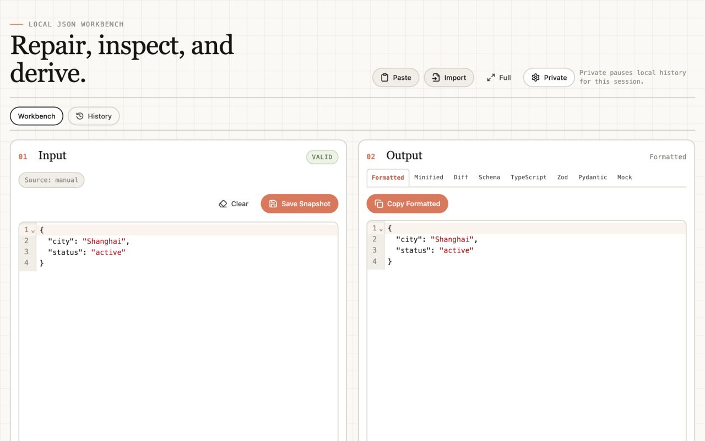

# JSON Workbench

JSON Workbench 是一个本地优先的 Chrome JSON 工具：修复脏 JSON，格式化，生成 JSON Schema、TypeScript、Zod、Pydantic 和语义化 Mock 数据。无 AI、无遥测、无网络请求。

- GitHub Repo: https://github.com/holynova/json-workbench-extension
- GitHub Pages: https://holynova.github.io/json-workbench-extension/

